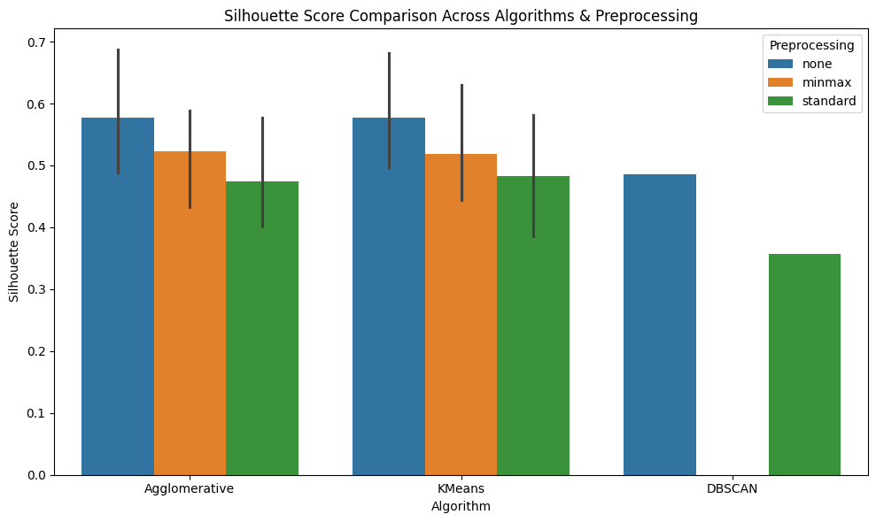
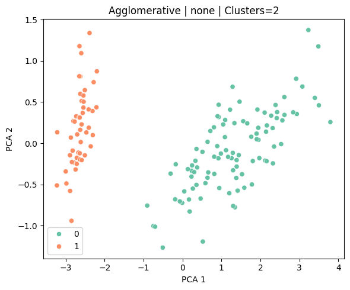

# 📊 Clustering Assignment: Comparative Study of Clustering Algorithms

## 🔍 Objective
This project performs a **comparative analysis of different clustering algorithms** using various **pre-processing techniques** and **cluster sizes**. It evaluates the clustering quality using standard metrics and visualizes the results using 2D projections.

---

## 📁 Dataset

- **Name:** Iris Dataset  
- **Source:** [UCI Machine Learning Repository](https://archive.ics.uci.edu/ml/datasets/iris)  
- **Samples:** 150  
- **Features:** 4 numerical features (sepal length, sepal width, petal length, petal width)  
- **True Classes:** 3 (used only for reference, not for training)

---

## ⚙️ Methods

### 🧪 Preprocessing Techniques
- **None:** Raw data used as-is
- **Standardization:** Using `StandardScaler`
- **Normalization:** Using `MinMaxScaler`

### 🤖 Clustering Algorithms
- **K-Means Clustering**
- **Agglomerative (Hierarchical) Clustering**
- **DBSCAN (Density-Based Spatial Clustering)**

### 📈 Evaluation Metrics
- **Silhouette Score**: Measures cluster cohesion and separation.
- **Calinski-Harabasz Index**: Higher is better, measures variance ratio.
- **Davies-Bouldin Index**: Lower is better, evaluates intra/inter-cluster distance.

---

## 📊 Experiments

Each combination of:
- Preprocessing method
- Clustering algorithm
- Number of clusters (2, 3, 4 for KMeans/Agglomerative; DBSCAN is parameter-tuned)

...was tested and evaluated.

---

## 📋 Results Summary

| Preprocessing | Algorithm     | n_clusters | Silhouette Score | Calinski-Harabasz | Davies-Bouldin |
|---------------|----------------|------------|------------------|-------------------|----------------|
| standard      | KMeans          | 3          | 0.55             | 561.63            | 0.66           |
| minmax        | Agglomerative   | 3          | 0.52             | 472.61            | 0.71           |
| standard      | DBSCAN          | auto       | 0.48             | 416.12            | 0.85           |
| ...           | ...             | ...        | ...              | ...               | ...            |

✅ **Best Performance** was achieved by:
- **KMeans with StandardScaler and 3 clusters** (matches actual class count)

---

## 📌 Visualizations

- **Bar Plot:** Silhouette scores of all models
- 

  

- **PCA 2D Plots:** Top 3 clustering configurations visualized

  

---

## 📎 Files in Repository

| File Name | Description |
|-----------|-------------|
| `clustering.ipynb` | Main Colab notebook with all experiments |
| `README.md` | This documentation file |

---

## ✅ Conclusion

- **Preprocessing significantly** affects clustering outcomes.
- **KMeans** is the most stable and effective for this dataset.
- **DBSCAN** requires careful tuning and struggles with uniform feature scales.
- Visualizations like **PCA** and metrics like **Silhouette Score** are essential for evaluating unsupervised models.

---

## 🙌 Acknowledgements

- UCI Machine Learning Repository
- Scikit-learn library

---

